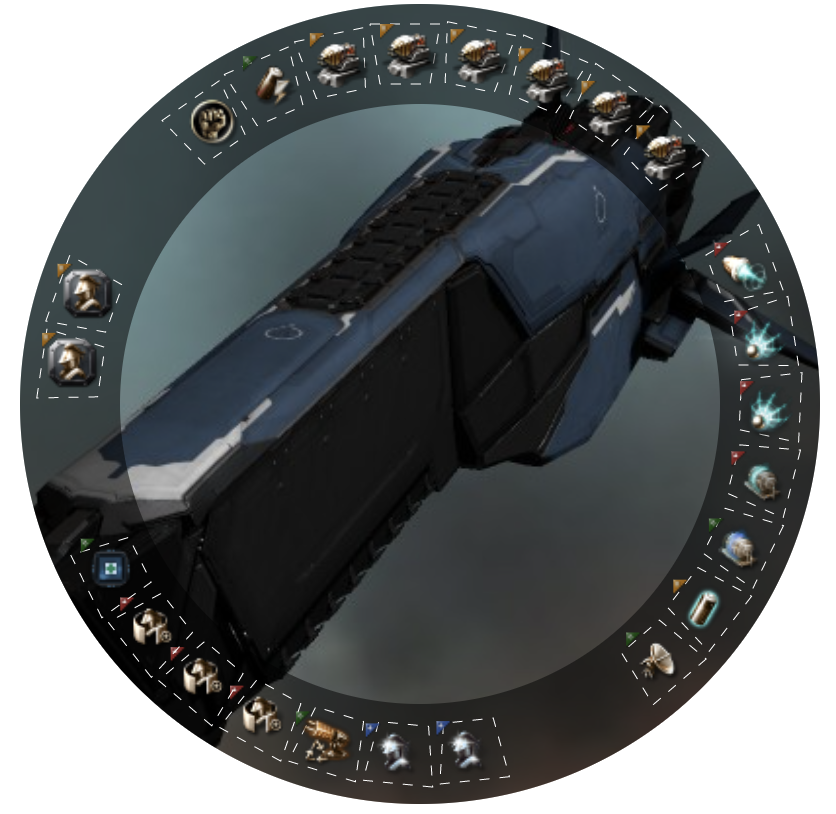

# Ship Fit - A Web Component for Eve Fittings



## Overview
A web component to render a visual representation of an EFT format fit for Eve Online.

## Examples
* [Examples](https://souptheloop.github.io/shipfit/)
* [JSFiddle Live Example](https://jsfiddle.net/souptheloop/k76u48ab/9/)

## Setup
Using the published bundle from unpkg
```html
<script src="https://unpkg.com/shipfit@1.1.0/dist/index.umd.min.js"></script>
<ship-fit>
[Revelation, Revelation]
Capital I-a Enduring Armor Repairer
Corpum A-Type Multispectrum Energized Membrane
Corpum A-Type Multispectrum Energized Membrane
Domination Tracking Enhancer
Imperial Navy Heat Sink
[Empty Low Slot]
Imperial Navy Heat Sink
Reactive Armor Hardener

Capital Capacitor Booster I
Heavy Stasis Grappler II
Shadow Serpentis Tracking Computer,Tracking Speed Script
Tracking Computer II,Tracking Speed Script

Abyssal Siege Module
Corpus X-Type Heavy Energy Neutralizer
Quad Mega Pulse Laser II,Conflagration XL
Quad Mega Pulse Laser II,Conflagration XL
Quad Mega Pulse Laser II,Conflagration XL

Capital Energy Ambit Extension I
Capital Energy Ambit Extension I
Capital Energy Burst Aerator II
</ship-fit>
```

## Configuration Options

The component supports the following HTML attributes

| Attribute        | Default   | Description
| ---------------- | --------- | -----------
| hide-copy        |           | Hides the copy fitting button when set

## Caveats
* If you use this in an environment where the fitting input is untrusted, 
you should ensure that input has been sanitized for XSS and other script injection / vulnerabilities
before it is placed into this component.
